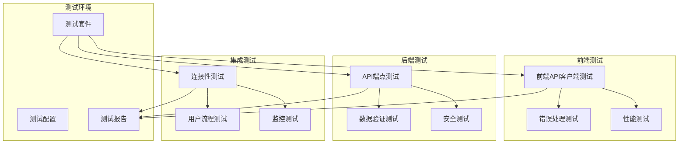

# API集成测试设计文档

## 概述

本设计文档描述了道教经典视频系统前后端API集成测试的完整解决方案。系统将通过自动化测试套件验证前端React应用与后端Django API之间的通信，确保所有API端点正常工作，错误处理机制有效，并且系统在各种负载条件下表现稳定。

## 架构设计

### 测试架构图



### 测试分层架构

1. **单元测试层**: 测试单个API端点的功能
2. **集成测试层**: 测试前后端交互流程
3. **端到端测试层**: 测试完整的用户场景
4. **性能测试层**: 测试系统在负载下的表现

## 组件和接口设计

### 1. 测试配置管理器

```python
class TestConfigManager:
    """测试配置管理器"""
    
    def __init__(self):
        self.backend_url = "http://localhost:6000"
        self.frontend_url = "http://localhost:5500"
        self.timeout = 30
        self.retry_count = 3
    
    def get_api_endpoints(self) -> Dict[str, str]:
        """获取所有API端点配置"""
        pass
    
    def get_test_data(self) -> Dict[str, Any]:
        """获取测试数据"""
        pass
```

### 2. API客户端测试器

```python
class APIClientTester:
    """API客户端测试器"""
    
    def __init__(self, config: TestConfigManager):
        self.config = config
        self.session = requests.Session()
    
    async def test_connection(self) -> TestResult:
        """测试API连接性"""
        pass
    
    async def test_authentication(self) -> TestResult:
        """测试认证流程"""
        pass
    
    async def test_endpoints(self) -> List[TestResult]:
        """测试所有API端点"""
        pass
```

### 3. 错误处理测试器

```python
class ErrorHandlingTester:
    """错误处理测试器"""
    
    def test_4xx_errors(self) -> TestResult:
        """测试4xx错误处理"""
        pass
    
    def test_5xx_errors(self) -> TestResult:
        """测试5xx错误处理"""
        pass
    
    def test_timeout_handling(self) -> TestResult:
        """测试超时处理"""
        pass
    
    def test_network_errors(self) -> TestResult:
        """测试网络错误处理"""
        pass
```

### 4. 性能测试器

```python
class PerformanceTester:
    """性能测试器"""
    
    def test_response_time(self) -> TestResult:
        """测试响应时间"""
        pass
    
    def test_concurrent_requests(self) -> TestResult:
        """测试并发请求"""
        pass
    
    def test_file_upload_performance(self) -> TestResult:
        """测试文件上传性能"""
        pass
    
    def test_load_handling(self) -> TestResult:
        """测试负载处理"""
        pass
```

### 5. 数据一致性测试器

```python
class DataConsistencyTester:
    """数据一致性测试器"""
    
    def test_json_serialization(self) -> TestResult:
        """测试JSON序列化"""
        pass
    
    def test_utf8_encoding(self) -> TestResult:
        """测试UTF-8编码"""
        pass
    
    def test_datetime_handling(self) -> TestResult:
        """测试日期时间处理"""
        pass
    
    def test_data_types(self) -> TestResult:
        """测试数据类型处理"""
        pass
```

## 数据模型

### 测试结果模型

```python
@dataclass
class TestResult:
    """测试结果数据模型"""
    test_name: str
    status: TestStatus  # PASS, FAIL, SKIP, ERROR
    duration: float
    message: str
    details: Dict[str, Any]
    timestamp: datetime
    
    def to_dict(self) -> Dict[str, Any]:
        """转换为字典格式"""
        pass

@dataclass
class APIEndpointTest:
    """API端点测试模型"""
    endpoint: str
    method: str
    expected_status: int
    test_data: Dict[str, Any]
    headers: Dict[str, str]
    
    def execute(self) -> TestResult:
        """执行测试"""
        pass

@dataclass
class TestSuite:
    """测试套件模型"""
    name: str
    tests: List[TestResult]
    start_time: datetime
    end_time: datetime
    
    def get_summary(self) -> Dict[str, Any]:
        """获取测试摘要"""
        pass
```

### API端点配置模型

```python
@dataclass
class APIEndpoint:
    """API端点配置"""
    name: str
    url: str
    method: str
    requires_auth: bool
    expected_response_schema: Dict[str, Any]
    test_cases: List[Dict[str, Any]]

# API端点配置
API_ENDPOINTS = {
    "auth": {
        "login": APIEndpoint(
            name="用户登录",
            url="/api/auth/login/",
            method="POST",
            requires_auth=False,
            expected_response_schema={
                "access": "string",
                "refresh": "string",
                "user": "object"
            },
            test_cases=[
                {"username": "test", "password": "test123"},
                {"username": "invalid", "password": "wrong"}
            ]
        ),
        # ... 其他认证端点
    },
    "videos": {
        "list": APIEndpoint(
            name="视频列表",
            url="/api/videos/",
            method="GET",
            requires_auth=True,
            expected_response_schema={
                "count": "integer",
                "results": "array"
            },
            test_cases=[
                {"page": 1, "page_size": 10},
                {"search": "test"}
            ]
        ),
        # ... 其他视频端点
    }
}
```

## 正确性属性

*属性是一个特征或行为，应该在系统的所有有效执行中保持为真——本质上是关于系统应该做什么的正式声明。属性作为人类可读规范和机器可验证正确性保证之间的桥梁。*

基于需求分析，以下是系统必须满足的正确性属性：

### 属性 1: API连接性保证
*对于任何* 有效的API配置，当前端应用尝试连接到后端API时，应该能够在超时时间内建立连接或返回明确的错误信息
**验证需求: 1.1, 1.2, 1.3, 1.4**

### 属性 2: 认证令牌管理一致性
*对于任何* 有效的用户凭证，认证流程应该返回有效的JWT令牌，并且客户端应该在所有需要认证的请求中自动包含这些令牌
**验证需求: 2.1, 2.2, 2.3, 2.6**

### 属性 3: 令牌刷新机制可靠性
*对于任何* 过期的访问令牌，如果刷新令牌有效，系统应该自动获取新的访问令牌；如果刷新令牌无效，应该重定向到登录页面
**验证需求: 2.4, 2.5**

### 属性 4: 视频API响应完整性
*对于任何* 视频相关的API请求，后端应该返回符合预期格式的响应数据，包括正确的分页信息、完整的视频详情和准确的搜索结果
**验证需求: 3.1, 3.2, 3.3, 3.4, 3.5**

### 属性 5: 异步任务状态一致性
*对于任何* 视频合成任务，系统应该能够创建任务、查询状态、提供下载链接和支持取消操作，并且任务状态应该准确反映实际进度
**验证需求: 4.1, 4.2, 4.3, 4.4, 4.5**

### 属性 6: 系统监控数据准确性
*对于任何* 系统监控请求，API应该返回准确的统计数据、存储信息、错误报告和性能指标
**验证需求: 5.1, 5.2, 5.3, 5.4**

### 属性 7: 错误处理一致性
*对于任何* API错误响应，客户端应该显示适当的错误消息、提供重试选项（如适用）、记录错误信息，并在认证失败时正确处理状态清理
**验证需求: 6.1, 6.2, 6.3, 6.4, 6.5, 6.6**

### 属性 8: 性能响应时间保证
*对于任何* 正常负载下的API请求，系统应该在规定时间内响应，支持大文件的分块上传，并在高负载时返回适当的限流响应
**验证需求: 7.1, 7.2, 7.3**

### 属性 9: 数据格式一致性
*对于任何* 前后端数据交换，JSON数据应该正确解析，数据类型应该正确处理，UTF-8编码应该正确支持，日期时间应该正确转换时区
**验证需求: 8.1, 8.2, 8.3, 8.4**

### 属性 10: 网络重试机制可靠性
*对于任何* 网络中断或连接失败的情况，客户端应该提供重试机制，并在重试失败后显示适当的错误信息
**验证需求: 1.5**

## 错误处理

### 错误分类和处理策略

1. **连接错误**
   - 网络不可达
   - 服务器未启动
   - 端口被占用
   - 处理: 显示连接错误，提供重试选项

2. **认证错误**
   - 无效凭证
   - 令牌过期
   - 权限不足
   - 处理: 清除认证状态，重定向到登录页

3. **数据错误**
   - 请求格式错误
   - 响应解析失败
   - 数据验证失败
   - 处理: 显示具体错误信息，记录详细日志

4. **性能错误**
   - 请求超时
   - 服务器过载
   - 资源不足
   - 处理: 显示性能警告，提供重试或降级选项

### 错误恢复机制

```python
class ErrorRecoveryManager:
    """错误恢复管理器"""
    
    def handle_connection_error(self, error: ConnectionError) -> RecoveryAction:
        """处理连接错误"""
        if self.is_network_available():
            return RecoveryAction.RETRY_WITH_BACKOFF
        else:
            return RecoveryAction.SHOW_OFFLINE_MESSAGE
    
    def handle_auth_error(self, error: AuthError) -> RecoveryAction:
        """处理认证错误"""
        if error.is_token_expired():
            return RecoveryAction.REFRESH_TOKEN
        else:
            return RecoveryAction.REDIRECT_TO_LOGIN
    
    def handle_timeout_error(self, error: TimeoutError) -> RecoveryAction:
        """处理超时错误"""
        return RecoveryAction.RETRY_WITH_LONGER_TIMEOUT
```

## 测试策略

### 测试框架选择

- **后端测试**: pytest + requests + hypothesis
- **前端测试**: Jest + React Testing Library + MSW (Mock Service Worker)
- **集成测试**: Playwright + pytest-asyncio
- **性能测试**: locust + pytest-benchmark

### 测试数据生成策略

```python
from hypothesis import strategies as st

# 用户数据生成策略
user_strategy = st.builds(
    dict,
    username=st.text(min_size=3, max_size=20, alphabet=st.characters(whitelist_categories=('Lu', 'Ll', 'Nd'))),
    email=st.emails(),
    password=st.text(min_size=8, max_size=50)
)

# 视频数据生成策略
video_strategy = st.builds(
    dict,
    title=st.text(min_size=1, max_size=100),
    description=st.text(max_size=500),
    category=st.sampled_from(['道德经', '庄子', '太极', '养生']),
    duration=st.integers(min_value=1, max_value=7200)
)

# API请求数据生成策略
api_request_strategy = st.builds(
    dict,
    method=st.sampled_from(['GET', 'POST', 'PUT', 'DELETE']),
    headers=st.dictionaries(st.text(), st.text()),
    params=st.dictionaries(st.text(), st.one_of(st.text(), st.integers(), st.booleans()))
)
```

### 测试执行策略

1. **并行执行**: 使用pytest-xdist进行并行测试
2. **分层执行**: 先执行单元测试，再执行集成测试
3. **条件执行**: 根据环境变量决定是否执行性能测试
4. **持续集成**: 集成到CI/CD流水线中

### 测试报告生成

```python
class TestReportGenerator:
    """测试报告生成器"""
    
    def generate_html_report(self, results: List[TestResult]) -> str:
        """生成HTML格式的测试报告"""
        pass
    
    def generate_json_report(self, results: List[TestResult]) -> Dict[str, Any]:
        """生成JSON格式的测试报告"""
        pass
    
    def generate_coverage_report(self) -> Dict[str, Any]:
        """生成API覆盖率报告"""
        pass
    
    def send_notification(self, report: Dict[str, Any]) -> None:
        """发送测试结果通知"""
        pass
```

## 实施计划

### 阶段1: 基础测试框架搭建
- 设置测试环境配置
- 创建基础测试类和工具函数
- 实现简单的连接性测试

### 阶段2: API端点测试实现
- 实现所有API端点的基础功能测试
- 添加认证和权限测试
- 实现数据验证测试

### 阶段3: 错误处理和边界测试
- 实现各种错误场景的测试
- 添加边界值和异常输入测试
- 实现网络故障模拟测试

### 阶段4: 性能和负载测试
- 实现响应时间测试
- 添加并发请求测试
- 实现文件上传性能测试

### 阶段5: 集成和端到端测试
- 实现完整用户流程测试
- 添加跨浏览器兼容性测试
- 实现自动化测试报告生成

### 阶段6: 持续集成和监控
- 集成到CI/CD流水线
- 设置测试结果监控和告警
- 实现测试数据分析和优化建议