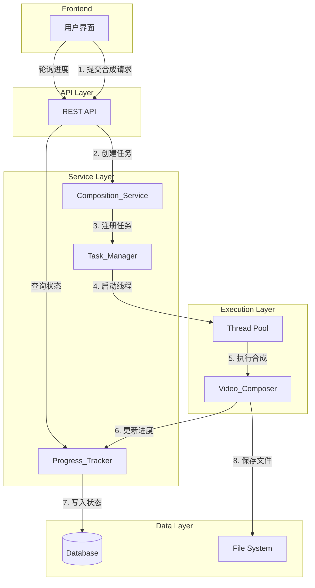
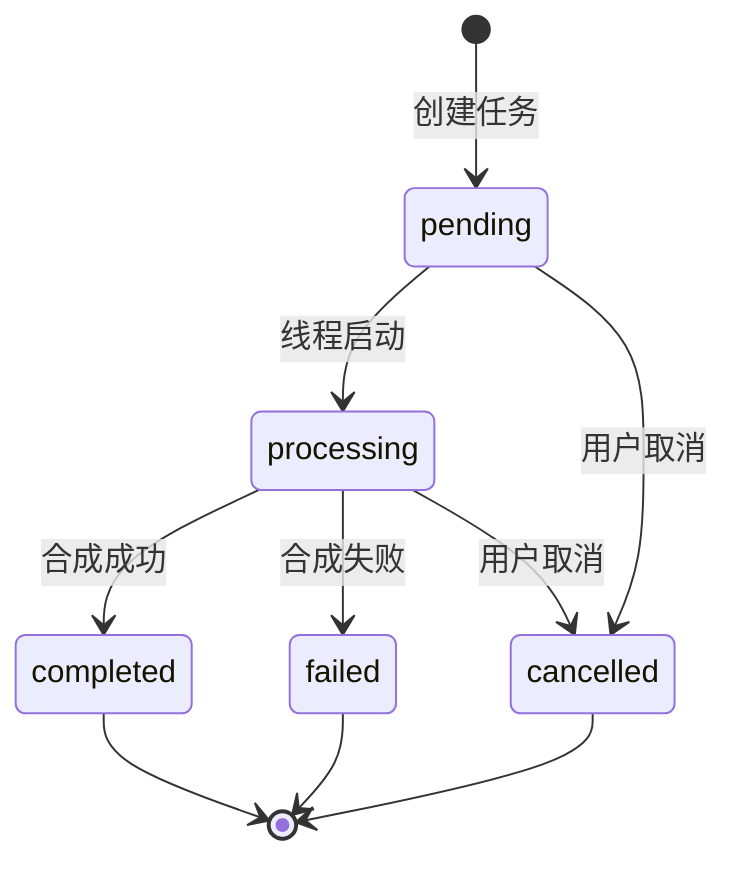

# Design Document: 异步视频合成

## Overview

本设计文档描述了基于 Python 线程的异步视频合成系统的技术实现方案。该系统将替代当前同步执行的 Celery EAGER 模式，实现真正的异步视频合成功能。

核心设计目标：
- 用户点击"合成视频"按钮后立即返回响应（<500ms）
- 视频合成在后台线程中异步执行
- 提供实时进度查询和任务管理功能
- 确保多线程环境下的数据安全和资源管理

## Architecture

### 系统架构图



### 任务状态流转图



## Components and Interfaces

### 1. Composition_Service（合成服务）

负责处理合成请求的入口服务。

```python
class CompositionService:
    """视频合成服务"""
    
    def create_task(self, user_id: int, video_ids: List[int], 
                    output_filename: Optional[str] = None) -> CompositionTaskResponse:
        """
        创建合成任务
        
        Args:
            user_id: 用户ID
            video_ids: 视频ID列表（至少2个）
            output_filename: 可选的输出文件名
            
        Returns:
            CompositionTaskResponse: 包含task_id和初始状态
            
        Raises:
            ValidationError: 视频数量少于2个
        """
        pass
```

### 2. Task_Manager（任务管理器）

负责管理后台线程和任务生命周期。

```python
class TaskManager:
    """任务管理器 - 线程安全的单例"""
    
    _instance = None
    _lock = threading.Lock()
    _tasks: Dict[str, TaskInfo] = {}
    
    def start_task(self, task_id: str) -> bool:
        """启动后台合成线程"""
        pass
    
    def cancel_task(self, task_id: str) -> CancelResult:
        """取消任务（仅限pending/processing状态）"""
        pass
    
    def get_task_info(self, task_id: str) -> Optional[TaskInfo]:
        """获取任务信息"""
        pass
    
    def cleanup_task(self, task_id: str) -> None:
        """清理任务资源"""
        pass
```

### 3. Progress_Tracker（进度跟踪器）

负责更新和查询任务进度。

```python
class ProgressTracker:
    """进度跟踪器 - 线程安全"""
    
    _lock = threading.Lock()
    
    def update_progress(self, task_id: str, progress: int, 
                        status: Optional[str] = None) -> None:
        """
        更新任务进度
        
        Args:
            task_id: 任务ID
            progress: 进度百分比 (0-100)
            status: 可选的状态更新
        """
        pass
    
    def get_progress(self, task_id: str) -> ProgressInfo:
        """获取任务进度信息"""
        pass
```

### 4. Video_Composer（视频合成器）

负责实际的视频文件合并操作。

```python
class VideoComposer:
    """视频合成器"""
    
    def __init__(self, task_id: str, progress_callback: Callable[[int], None]):
        self.task_id = task_id
        self.progress_callback = progress_callback
        self._cancelled = threading.Event()
    
    def compose(self, video_paths: List[str], output_path: str) -> CompositionResult:
        """
        执行视频合成
        
        Args:
            video_paths: 输入视频文件路径列表
            output_path: 输出文件路径
            
        Returns:
            CompositionResult: 合成结果
        """
        pass
    
    def cancel(self) -> None:
        """设置取消标志"""
        self._cancelled.set()
    
    def is_cancelled(self) -> bool:
        """检查是否已取消"""
        return self._cancelled.is_set()
```

### API 接口定义

| 端点 | 方法 | 描述 | 响应时间要求 |
|------|------|------|-------------|
| `/api/videos/compose/` | POST | 创建合成任务 | <500ms |
| `/api/videos/compose/{task_id}/` | GET | 查询任务状态 | <100ms |
| `/api/videos/compose/{task_id}/` | DELETE | 取消任务 | <200ms |
| `/api/videos/compose/` | GET | 获取任务列表 | <500ms |

## Data Models

### TaskInfo 数据结构

```python
@dataclass
class TaskInfo:
    """任务信息"""
    task_id: str
    status: TaskStatus  # pending, processing, completed, failed, cancelled
    progress: int  # 0-100
    created_at: datetime
    started_at: Optional[datetime]
    completed_at: Optional[datetime]
    error_message: Optional[str]
    output_file: Optional[str]
    thread: Optional[threading.Thread]
    cancel_event: threading.Event
```

### ProgressInfo 数据结构

```python
@dataclass
class ProgressInfo:
    """进度信息"""
    task_id: str
    status: str
    progress: int
    output_file: Optional[str]
    error_message: Optional[str]
```

### 数据库模型更新

现有的 `CompositionTask` 模型已满足需求，无需修改。关键字段：
- `task_id`: 唯一任务标识
- `status`: 任务状态
- `progress`: 进度百分比
- `output_file`: 输出文件
- `error_message`: 错误信息

## Correctness Properties

*A property is a characteristic or behavior that should hold true across all valid executions of a system-essentially, a formal statement about what the system should do. Properties serve as the bridge between human-readable specifications and machine-verifiable correctness guarantees.*

### Property 1: 响应时间保证

*For any* 合成请求，Composition_Service 返回响应的时间应小于 500ms，无论后台合成任务的复杂度如何。

**Validates: Requirements 1.1**

### Property 2: 任务ID唯一性

*For any* 两个不同的合成任务，它们的 task_id 必须不同。即使在高并发场景下创建多个任务，每个任务ID都应该是唯一的。

**Validates: Requirements 1.2, 5.1**

### Property 3: 异步执行验证

*For any* 成功创建的合成任务，主线程应在返回响应后立即可用，后台线程应已启动执行合成操作。

**Validates: Requirements 1.3**

### Property 4: 状态转换正确性

*For any* 合成任务，其状态转换必须遵循以下规则：
- pending → processing（线程启动时）
- pending → cancelled（用户取消时）
- processing → completed（合成成功时）
- processing → failed（合成失败时）
- processing → cancelled（用户取消时）

不允许其他状态转换路径。

**Validates: Requirements 2.1, 2.3, 2.4**

### Property 5: 进度更新一致性

*For any* 处于 processing 状态的任务，其进度值必须：
- 在 0-100 范围内
- 单调递增（不会回退）
- 完成时达到 100

**Validates: Requirements 2.2**

### Property 6: 查询返回值完整性

*For any* 任务状态查询：
- 必须返回有效的进度百分比（0-100）
- 必须返回有效的状态值（pending/processing/completed/failed/cancelled）
- 当状态为 completed 时，必须包含输出文件信息

**Validates: Requirements 3.1, 3.2, 3.3**

### Property 7: 取消操作正确性

*For any* 取消请求：
- 当任务状态为 pending 或 processing 时，取消操作应成功
- 当任务状态为 completed、failed 或 cancelled 时，取消操作应被拒绝

**Validates: Requirements 4.1, 4.2, 4.3**

### Property 8: 线程安全与资源管理

*For any* 后台线程执行：
- 数据库连接应在线程结束时正确关闭
- 异常退出时应正确清理资源
- 多线程并发访问时数据应保持一致

**Validates: Requirements 5.1, 5.2, 5.3**

## Error Handling

### 错误类型与处理策略

| 错误类型 | 处理策略 | 用户提示 |
|---------|---------|---------|
| 视频数量不足 | 拒绝请求，返回400 | "至少需要选择两个视频进行合成" |
| 视频文件不存在 | 标记任务失败 | "部分视频文件不存在" |
| 合成过程异常 | 标记任务失败，记录日志 | "视频合成失败，请稍后重试" |
| 磁盘空间不足 | 标记任务失败 | "存储空间不足" |
| 线程异常退出 | 清理资源，标记失败 | "系统错误，请稍后重试" |

### 异常处理代码示例

```python
def run_composition_in_thread(task_id: str) -> None:
    """后台线程执行函数"""
    try:
        # 关闭继承的数据库连接
        connection.close()
        
        # 执行合成逻辑
        _do_composition(task_id)
        
    except Exception as e:
        logger.error(f"合成任务 {task_id} 失败: {str(e)}", exc_info=True)
        _mark_task_failed(task_id, str(e))
        
    finally:
        # 确保数据库连接关闭
        connection.close()
```

## Testing Strategy

### 测试框架

- **单元测试**: pytest
- **属性测试**: hypothesis
- **并发测试**: concurrent.futures

### 单元测试覆盖

1. **CompositionService 测试**
   - 正常创建任务
   - 视频数量验证
   - 响应时间验证

2. **TaskManager 测试**
   - 任务启动
   - 任务取消
   - 状态查询

3. **ProgressTracker 测试**
   - 进度更新
   - 并发访问

4. **VideoComposer 测试**
   - 视频合成
   - 取消处理

### 属性测试配置

```python
from hypothesis import given, strategies as st, settings

@settings(max_examples=100)
@given(st.lists(st.integers(min_value=1), min_size=2, max_size=10))
def test_task_creation_returns_unique_ids(video_ids):
    """Property 2: 任务ID唯一性"""
    # 测试实现
    pass
```

### 测试优先级

1. **高优先级**
   - Property 4: 状态转换正确性
   - Property 7: 取消操作正确性
   - Property 8: 线程安全与资源管理

2. **中优先级**
   - Property 2: 任务ID唯一性
   - Property 5: 进度更新一致性
   - Property 6: 查询返回值完整性

3. **低优先级**
   - Property 1: 响应时间保证（性能测试）
   - Property 3: 异步执行验证

## Implementation Notes

### 设计决策

1. **使用 Python 线程而非 Celery**
   - 原因：当前环境使用 CELERY_TASK_ALWAYS_EAGER=True，Celery 任务同步执行
   - 优势：简化部署，无需额外的消息队列
   - 权衡：单机限制，但对于当前规模足够

2. **使用 threading.Event 实现取消**
   - 原因：提供协作式取消机制
   - 优势：允许合成过程在安全点检查取消状态
   - 权衡：需要在合成循环中定期检查

3. **数据库连接管理**
   - 原因：Django 数据库连接不是线程安全的
   - 策略：在后台线程开始时关闭继承的连接，让 Django 创建新连接
   - 清理：在 finally 块中确保连接关闭

4. **进度更新粒度**
   - 选择：每10%更新一次
   - 原因：平衡实时性和数据库写入开销
   - 实现：在视频处理循环中计算进度百分比
