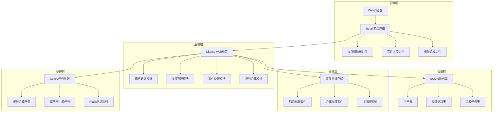
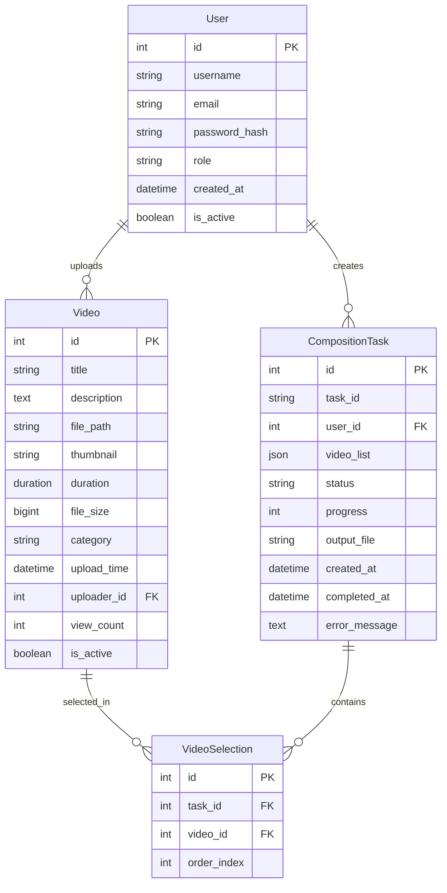

# 道士经文视频管理系统设计文档

## 概述

道士经文视频管理系统是一个基于Web的视频管理平台，专门用于道教经文视频的上传、管理、播放和合成。系统采用Django作为后端框架，结合现代前端技术，为管理员和普通用户提供不同层级的功能服务。

## 架构

### 系统架构图



### 技术栈选择

**后端技术栈：**
- **Web框架**: Django 5.2 - 成熟的Python Web框架，内置用户认证和文件处理
- **数据库**: SQLite - 轻量级文件数据库，适合中小型应用和快速开发
- **任务队列**: Celery + Redis - 处理视频合成等耗时任务
- **视频处理**: FFmpeg + MoviePy - 专业的视频处理工具链

**前端技术栈：**
- **框架**: React 18 - 现代化的用户界面框架
- **视频播放器**: Plyr - 轻量级、可定制的HTML5视频播放器
- **文件上传**: React-Dropzone - 支持拖拽上传的文件上传组件
- **状态管理**: Redux Toolkit - 管理应用状态

## 组件和接口

### 核心组件

#### 1. 用户认证组件 (AuthenticationComponent)

**职责**: 处理用户登录、注册和权限验证

**接口**:
```python
class AuthenticationService:
    def authenticate_user(username: str, password: str) -> User
    def check_user_permission(user: User, permission: str) -> bool
    def get_user_role(user: User) -> UserRole
```

**实现要点**:
- 使用Django内置的认证系统
- 支持基于角色的权限控制（RBAC）
- 提供JWT令牌用于前后端分离认证

#### 2. 视频管理组件 (VideoManagementComponent)

**职责**: 处理视频的CRUD操作和元数据管理

**接口**:
```python
class VideoService:
    def upload_video(file: UploadedFile, metadata: VideoMetadata) -> Video
    def get_video_list(user: User, filters: dict) -> List[Video]
    def get_video_detail(video_id: int) -> Video
    def update_video_metadata(video_id: int, metadata: VideoMetadata) -> Video
    def delete_video(video_id: int) -> bool
```

**数据模型**:
```python
class Video(models.Model):
    title = models.CharField(max_length=200, verbose_name="标题")
    description = models.TextField(verbose_name="描述")
    file_path = models.FileField(upload_to='videos/%Y/%m/%d/', verbose_name="视频文件")
    thumbnail = models.ImageField(upload_to='thumbnails/%Y/%m/%d/', verbose_name="缩略图")
    duration = models.DurationField(verbose_name="时长")
    file_size = models.BigIntegerField(verbose_name="文件大小")
    category = models.CharField(max_length=100, verbose_name="分类")
    upload_time = models.DateTimeField(auto_now_add=True, verbose_name="上传时间")
    uploader = models.ForeignKey(User, on_delete=models.CASCADE, verbose_name="上传者")
    view_count = models.IntegerField(default=0, verbose_name="观看次数")
    is_active = models.BooleanField(default=True, verbose_name="是否激活")
```

#### 3. 视频播放组件 (VideoPlayerComponent)

**职责**: 提供在线视频播放功能

**前端组件接口**:
```typescript
interface VideoPlayerProps {
  videoUrl: string;
  title: string;
  onPlay?: () => void;
  onPause?: () => void;
  onEnded?: () => void;
}

class VideoPlayer extends React.Component<VideoPlayerProps> {
  // 播放器控制方法
  play(): void;
  pause(): void;
  seek(time: number): void;
  setVolume(volume: number): void;
}
```

**实现要点**:
- 使用Plyr播放器提供统一的播放体验
- 支持多种视频格式（MP4、WebM、AVI等）
- 自适应视频质量和网络状况
- 记录播放统计信息

#### 4. 视频合成组件 (VideoCompositionComponent)

**职责**: 处理多个视频的合成和下载

**接口**:
```python
class VideoCompositionService:
    def create_composition_task(video_ids: List[int], user: User) -> CompositionTask
    def get_task_status(task_id: str) -> TaskStatus
    def download_composed_video(task_id: str) -> FileResponse
```

**数据模型**:
```python
class CompositionTask(models.Model):
    task_id = models.CharField(max_length=100, unique=True, verbose_name="任务ID")
    user = models.ForeignKey(User, on_delete=models.CASCADE, verbose_name="用户")
    video_list = models.JSONField(verbose_name="视频列表")
    status = models.CharField(max_length=20, choices=TASK_STATUS_CHOICES, verbose_name="状态")
    progress = models.IntegerField(default=0, verbose_name="进度百分比")
    output_file = models.FileField(upload_to='composed/%Y/%m/%d/', null=True, verbose_name="输出文件")
    created_at = models.DateTimeField(auto_now_add=True, verbose_name="创建时间")
    completed_at = models.DateTimeField(null=True, verbose_name="完成时间")
    error_message = models.TextField(null=True, verbose_name="错误信息")
```

#### 5. 文件存储组件 (FileStorageComponent)

**职责**: 管理视频文件的存储和访问

**接口**:
```python
class FileStorageService:
    def save_video_file(file: UploadedFile, path: str) -> str
    def generate_thumbnail(video_path: str) -> str
    def get_file_url(file_path: str) -> str
    def delete_file(file_path: str) -> bool
    def get_file_info(file_path: str) -> FileInfo
```

## 数据模型

### 数据库设计



### 数据访问层

**Repository模式实现**:
```python
class VideoRepository:
    def find_by_category(self, category: str) -> QuerySet[Video]
    def find_by_uploader(self, user: User) -> QuerySet[Video]
    def search_by_title(self, keyword: str) -> QuerySet[Video]
    def get_popular_videos(self, limit: int) -> QuerySet[Video]

class CompositionTaskRepository:
    def find_by_user(self, user: User) -> QuerySet[CompositionTask]
    def find_pending_tasks(self) -> QuerySet[CompositionTask]
    def update_task_progress(self, task_id: str, progress: int) -> None
```

## 错误处理

### 错误分类和处理策略

#### 1. 文件上传错误
- **文件格式不支持**: 返回400错误，提示支持的格式列表
- **文件大小超限**: 返回413错误，提示最大文件大小限制
- **存储空间不足**: 返回507错误，通知管理员扩容

#### 2. 视频处理错误
- **视频文件损坏**: 返回422错误，要求重新上传
- **编码格式不兼容**: 自动转码或提示用户转换格式
- **处理超时**: 返回408错误，建议分段处理

#### 3. 合成任务错误
- **内存不足**: 降低处理质量或分批处理
- **磁盘空间不足**: 清理临时文件，通知管理员
- **FFmpeg处理失败**: 记录详细错误日志，提供重试机制

#### 4. 用户权限错误
- **未登录访问**: 重定向到登录页面
- **权限不足**: 返回403错误，显示权限说明
- **会话过期**: 自动刷新令牌或要求重新登录

### 错误处理实现

```python
class VideoProcessingException(Exception):
    """视频处理异常基类"""
    pass

class FileFormatException(VideoProcessingException):
    """文件格式异常"""
    pass

class FileSizeException(VideoProcessingException):
    """文件大小异常"""
    pass

@api_view(['POST'])
def upload_video(request):
    try:
        video_service = VideoService()
        result = video_service.upload_video(request.FILES['video'], request.data)
        return Response(result, status=201)
    except FileFormatException as e:
        return Response({'error': '不支持的文件格式', 'details': str(e)}, status=400)
    except FileSizeException as e:
        return Response({'error': '文件大小超出限制', 'details': str(e)}, status=413)
    except Exception as e:
        logger.error(f"视频上传失败: {str(e)}")
        return Response({'error': '上传失败，请稍后重试'}, status=500)
```

## 测试策略

### 测试层次结构

#### 1. 单元测试
- **模型测试**: 验证数据模型的字段验证和方法逻辑
- **服务测试**: 测试业务逻辑的正确性
- **工具函数测试**: 测试辅助函数的边界条件

#### 2. 集成测试
- **API测试**: 验证REST API的输入输出
- **数据库测试**: 测试数据访问层的查询逻辑
- **文件操作测试**: 测试文件上传和存储功能

#### 3. 端到端测试
- **用户流程测试**: 模拟完整的用户操作流程
- **视频处理测试**: 测试视频上传到播放的完整链路
- **合成功能测试**: 测试多视频合成的完整流程

### 测试工具和框架

**后端测试**:
- **单元测试**: Django TestCase + pytest
- **API测试**: Django REST framework test client
- **模拟测试**: unittest.mock

**前端测试**:
- **组件测试**: React Testing Library
- **端到端测试**: Cypress
- **性能测试**: Lighthouse CI

**测试数据管理**:
- **测试数据库**: SQLite（开发和测试环境）
- **测试文件**: 预制的小尺寸视频文件
- **Mock服务**: 模拟外部依赖服务

## 正确性属性

*属性是一个特征或行为，应该在系统的所有有效执行中保持为真——本质上是关于系统应该做什么的正式声明。属性作为人类可读规范和机器可验证正确性保证之间的桥梁。*

### 属性 1: 用户认证和访问控制
*对于任何* 未认证用户和任何受保护的系统端点，访问该端点应该要求身份认证或重定向到登录页面
**验证需求: 需求 1.1, 1.5**

### 属性 2: 基于角色的菜单显示
*对于任何* 已认证用户，系统显示的功能菜单应该与该用户的角色权限完全匹配
**验证需求: 需求 1.2**

### 属性 3: 文件格式验证和错误处理
*对于任何* 上传的文件，如果文件格式不在支持列表中，系统应该拒绝上传并返回具体的错误信息
**验证需求: 需求 2.1, 2.5**

### 属性 4: 视频保存完整性
*对于任何* 成功上传并保存元数据的视频，该视频应该能够在视频库中被检索到，且包含完整的元数据信息
**验证需求: 需求 2.4**

### 属性 5: 视频列表渲染完整性
*对于任何* 视频列表中的视频项，渲染结果应该包含缩略图、标题和描述信息
**验证需求: 需求 3.2**

### 属性 6: 搜索功能准确性
*对于任何* 搜索查询和视频库，返回的搜索结果中的每个视频的标题或描述都应该包含搜索关键词
**验证需求: 需求 3.4**

### 属性 7: 分类筛选准确性
*对于任何* 分类筛选操作，返回的视频列表中的所有视频都应该属于指定的分类
**验证需求: 需求 3.5**

### 属性 8: 播放器控制响应性
*对于任何* 播放器控制操作（播放、暂停、快进、快退、音量调节），系统应该立即响应并更新播放状态
**验证需求: 需求 4.2, 4.3**

### 属性 9: 视频选择状态一致性
*对于任何* 视频选择操作序列，选中视频的数量、预览列表内容和复选框状态应该始终保持一致
**验证需求: 需求 5.1, 5.2, 5.3, 5.5**

### 属性 10: 视频合成完整性
*对于任何* 成功完成的视频合成任务，输出的合成视频应该按顺序包含所有选中的输入视频内容
**验证需求: 需求 6.3**

### 属性 11: 合成错误处理
*对于任何* 视频合成过程中发生的错误，系统应该记录具体错误信息并允许用户重新尝试合成
**验证需求: 需求 6.6**

### 属性 12: 视频编辑功能
*对于任何* 管理员对视频元数据的编辑操作，修改后的信息应该正确保存并在后续查询中反映出来
**验证需求: 需求 7.2**

### 属性 13: 视频删除完整性
*对于任何* 管理员删除的视频，该视频及其相关文件应该从系统中完全移除，且无法再被检索到
**验证需求: 需求 7.3**

### 属性 14: 批量操作一致性
*对于任何* 批量操作（删除或分类），操作应该对所有选中的视频生效，且操作结果保持一致
**验证需求: 需求 7.5**

### 属性 15: 存储空间监控
*对于任何* 存储空间不足的情况，系统应该向管理员发送警告通知并阻止新的上传操作
**验证需求: 需求 8.4**

### 属性 16: 数据备份完整性
*对于任何* 执行的数据备份操作，备份文件应该包含所有用户数据和视频文件的完整信息
**验证需求: 需求 8.5**